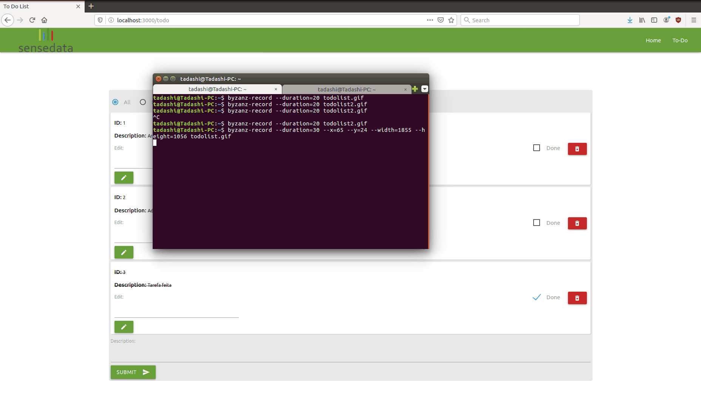

# to-do-list-python-flask-react

## About

This project was made using React, React Router, Python, Flask, Flask-CORS, Flask-Migrate and SQLAlchemy

## How to run

### Backend

With the terminal open on `/backend`

```bash
python3 -m venv env # to create a new env
source env/bin/activate # to activate the env just created
pip install -r requirements.txt # to install all projects requirements
flask run  # run app
```

### Frontend

With the terminal open on `/frontend`

```bash
npm install # to install all projects requirements
npm start  # run app
```


